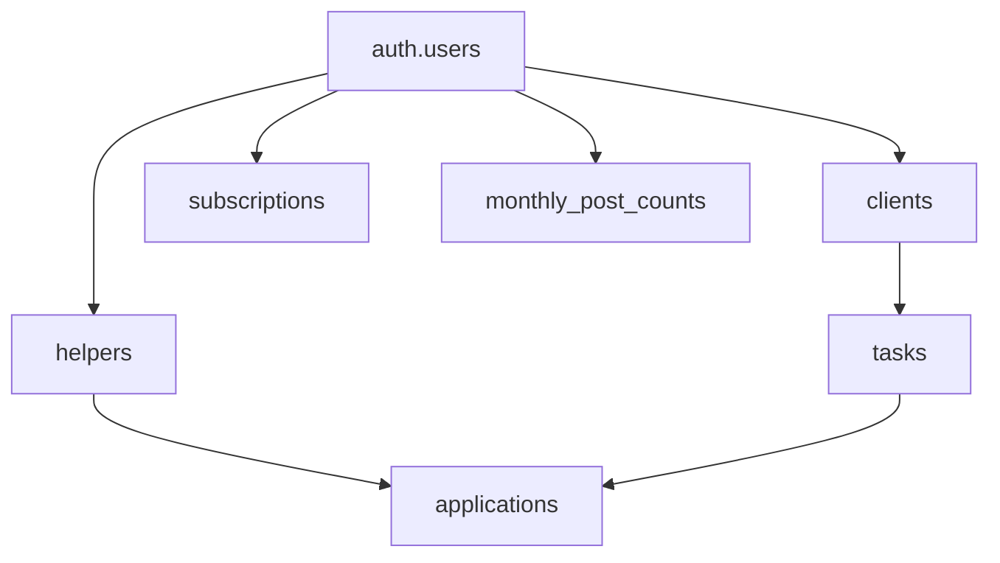

# HelperU - Task Assistance Platform

## 💼 Business Model

### **Freemium Subscription Tiers**
- **🆓 Free Tier**: 1 task post per month
- **💎 Premium Tier**: Unlimited task posts
- **💰 Revenue**: Monthly subscription fees from premium users

### **How It Works**
1. **Clients** post tasks they need help with
2. **Helpers** browse and apply for tasks they can handle
3. **Clients** review applications and choose the best helper
4. **Helpers** complete the task and get paid
5. **Both parties** leave reviews for future reference

## 🏗️ Technical Architecture

### **Backend Stack**
- **FastAPI** - Modern, fast web framework for building APIs
- **Supabase** - Open source Firebase alternative with PostgreSQL
- **Stripe** - Payment processing and subscription management
- **Python 3.11+** - Backend programming language
- **UV** - Package management and centralized dependency management

### **Database Design**
- **PostgreSQL** - Robust relational database
- **Row Level Security (RLS)** - Data isolation and security
- **Real-time subscriptions** - Live updates via Supabase
- **Optimized queries** - Fast performance with proper indexing

### **Security Features**
- **JWT Authentication** - Secure token-based auth
- **Phone verification** - OTP-based signup
- **Input validation** - Pydantic model validation
- **Rate limiting** - Subscription-based post limits
- **Data encryption** - Secure storage and transmission

## 🚀 Getting Started

### **Prerequisites**
- Python 3.11 or higher
- Supabase account and project
- Stripe account for payments
- Git for version control

### **Quick Start**
```bash
# 1. Clone the repository
git clone https://github.com/yourusername/HelperU_v2.git
cd HelperU_v2

# 2. Install dependencies
uv add stripe==8.10.0

# 3. Set up environment variables
cp env.template .env
# Edit .env with your credentials

# 4. Run the API
uvicorn app.main:app --reload
```

### **Environment Setup**
```env
# Supabase Configuration
SUPABASE_URL=your_supabase_url
SUPABASE_ANON_KEY=your_anon_key
SUPABASE_SERVICE_ROLE_KEY=your_service_role_key

# Stripe Configuration
STRIPE_SECRET_KEY=sk_test_...
STRIPE_PUBLISHABLE_KEY=pk_test_...
STRIPE_WEBHOOK_SECRET=whsec_...
STRIPE_PREMIUM_PRICE_ID=price_...
```

## 📚 API Documentation

### **Interactive Docs**
- **Swagger UI**: `http://localhost:8000/docs`
- **ReDoc**: `http://localhost:8000/redoc`

### **Documentation Files**
- **[API_ENDPOINTS.md](./API_ENDPOINTS.md)** - Complete API reference
- **[DEVELOPER_QUICK_REFERENCE.md](./DEVELOPER_QUICK_REFERENCE.md)** - Developer guide
- **[STRIPE_INTEGRATION_README.md](./STRIPE_INTEGRATION_README.md)** - Stripe setup

## 🗄️ Database Schema

### **Core Tables**
- **`clients`** - Client user profiles and preferences
- **`helpers`** - Helper profiles, skills, and availability
- **`tasks`** - Posted tasks with requirements and status
- **`applications`** - Helper applications for tasks
- **`subscriptions`** - User subscription plans and status
- **`monthly_post_counts`** - Free tier usage tracking

### **Key Relationships**


## 💳 Stripe Integration

### **What Stripe Handles**
- ✅ **Payment processing** for premium subscriptions
- ✅ **Subscription lifecycle** management
- ✅ **Webhook events** for real-time updates
- ✅ **Customer billing** and invoicing

### **What Your App Handles**
- ✅ **Business logic** and usage tracking
- ✅ **Post limit enforcement** (1/month for free users)
- ✅ **User experience** and upgrade prompts
- ✅ **Data synchronization** with Stripe events

## 🧪 Testing

### **Test Scenarios**
```bash
# 1. Test free user limits
# - Create free user account
# - Post one task (should succeed)
# - Try second task (should fail with 403)

# 2. Test premium user
# - Upgrade to premium
# - Post multiple tasks (should all succeed)

# 3. Test Stripe webhooks
# - Use Stripe CLI for local testing
# - Verify database updates
```

### **API Testing**
```bash
# Health check
curl http://localhost:8000/healthz

# Get API docs
curl http://localhost:8000/docs
```

## 🚀 Deployment

### **Production Checklist**
- [ ] Set production environment variables
- [ ] Configure production Stripe webhooks
- [ ] Set up monitoring and logging
- [ ] Test subscription flows end-to-end
- [ ] Verify security policies
- [ ] Set up backup procedures

### **Recommended Hosting**
- **Backend**: Railway, Render, or DigitalOcean
- **Database**: Supabase (managed PostgreSQL)
- **Payments**: Stripe (production environment)
- **Monitoring**: Sentry for error tracking

## 🤝 Contributing

### **Development Guidelines**
- Keep files under 500 lines
- Use modular component architecture
- Follow FastAPI best practices
- Write comprehensive tests
- Document all API changes

### **Code Style**
- **Python**: Follow PEP 8 guidelines
- **SQL**: Use consistent naming conventions
- **API**: RESTful design principles
- **Security**: Always validate inputs

## 📊 Monitoring & Analytics

### **Key Metrics**
- **User engagement**: Posts per user, completion rates
- **Business metrics**: Conversion rates, churn analysis
- **Technical metrics**: API response times, error rates
- **Financial metrics**: Subscription revenue, payment success

### **Debug Tools**
```sql
-- Check user subscription status
SELECT * FROM subscriptions WHERE user_id = 'user-uuid';

-- Monitor monthly post usage
SELECT * FROM monthly_post_counts 
WHERE year_month = '2024-01';

-- Track webhook events
SELECT * FROM subscription_events 
ORDER BY created_at DESC LIMIT 10;
```

## 🔒 Security & Compliance

### **Data Protection**
- **GDPR compliant** data handling
- **Secure authentication** with JWT tokens
- **Encrypted data** transmission (HTTPS)
- **Regular security** audits and updates

### **Privacy Features**
- **User consent** management
- **Data retention** policies
- **Right to deletion** implementation
- **Transparent data** usage

## 🌍 Use Cases

### **Academic Help**
- Math tutoring
- Science projects
- Language learning
- Test preparation

### **Home Services**
- Cleaning assistance
- Moving help
- Pet sitting
- Garden maintenance

### **Professional Services**
- Resume writing
- Interview coaching
- Business consulting
- Technical support

### **Creative Projects**
- Photography
- Graphic design
- Content writing
- Video editing

## 📱 Future Roadmap

### **Phase 1** (Current)
- ✅ Core platform functionality
- ✅ User authentication
- ✅ Task posting and management
- ✅ Stripe subscription integration

### **Phase 2** (Planned)
- 🔄 **Mobile app** development
- 🔄 **Advanced matching** algorithms
- 🔄 **Video calling** integration
- 🔄 **Multi-language** support

### **Phase 3** (Future)
- 🔮 **AI-powered** task matching
- 🔮 **Blockchain** payments
- 🔮 **VR/AR** task visualization
- 🔮 **Global expansion**

## 📞 Support & Contact

### **Getting Help**
- **Documentation**: Check the docs folder
- **Issues**: Use GitHub issues for bugs
- **Discussions**: GitHub discussions for questions
- **Email**: support@helperu.com

### **Community**
- **Discord**: Join our developer community
- **Blog**: Read our latest updates
- **Newsletter**: Stay informed about new features

## 📄 License

This project is licensed under the MIT License - see the [LICENSE](LICENSE) file for details.

## 🙏 Acknowledgments

- **FastAPI** team for the excellent web framework
- **Supabase** for the amazing open-source backend
- **Stripe** for reliable payment processing
- **Open source community** for inspiration and tools

---

**Built with ❤️ for connecting people who need help with those who can provide it.**

*HelperU - Making help accessible to everyone.*
